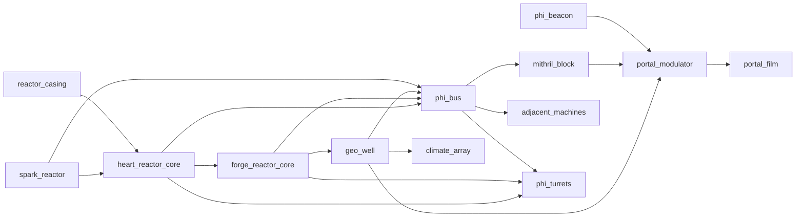

# Technomagic tree

Craft stays **free**. Operating Era N machines requires completing **all available** catalog nodes of eras 1..N−1 (craft their icon items to discover them). Machines also consume prior-era resources (Φ-heat, charged cells, Φ-flux slugs).

See also [ROADMAP.md](ROADMAP.md) Stage IV.

## Progression rules

| Rule | Effect |
|------|--------|
| Free craft | Recipes are never recipe-gated |
| Era complete | Every `available` node in that era is discovered |
| Operate Era N | Eras 1..N−1 must be complete (creative mode bypasses) |
| Resource chain | Era II needs Era I heat; Era III needs MED burner + Φ-cell; Era IV Spark needs flux slug; Heart needs pure essonite / flux priming + coolant; Forge needs star/pure essonite or charged cell; Era V Geo needs charged cell/flux + coolant; Climate/Portal burn Φ-power from a hub |

## Eras

| Era | Theme | Status |
|-----|--------|--------|
| I — Hearth | Torch, campfire heat, crucible, mortar | **Playable** |
| II — Workshop | Burner, Φ-furnace, glass/flasks, alembic, filters, cell, focus | **Playable** |
| III — Imprint | Ψ-imprinter, golem / telegraph, artifact craft, seals, jewelry, **Φ-crusher** | **Playable** |
| IV — Reactors | Spark, Heart 3×3×3, Φ-bus, Forge 3×4×3, **Φ-turrets** | **Playable** |
| V — Geo | Geo Well 3×3×3, Climate Array, mithril-frame Portal | **Playable** |

## Era IV Heart multiblock (3×3×3)

Around `heart_reactor_core`:

| Position | Block |
|----------|--------|
| 8 corners | `void_obsidian` |
| 12 edges | `reactor_casing` |
| 6 face centers | `phi_glass` |
| Center | `heart_reactor_core` |

When the shell is valid, it **assembles**: shell cells become invisible `heart_reactor_part`s and the core BER draws one solid textured 3×3×3. Click any part/core to open the fuel GUI. Breaking a part or the core dismantles and restores the materials (broken cell drops its original block).

Prime with **1× pure essonite** or **4× phi_flux_slug**, then START. Ambient Φ while formed+running (`PhiPower` radius 8; hull parts are Φ-transparent for LOS). Place ice/water/Φ-water just outside the shell to cool. Adjacent `phi_bus` on the **hull** (or Spark) energizes the cable (BFS to controller; hop attenuation); bus outlets are `PhiPowerProvider` radius 1 — place the last bus **adjacent to the machine** (turret mount).

## Era IV Forge multiblock (3×4×3)

One layer taller than Heart. Core at relative `(0,0,0)`; shell `dx,dz ∈ {-1,0,1}`, `dy ∈ {-1,0,1,2}`:

| Cell | Block |
|------|--------|
| Vertical corner pillars | `void_obsidian` |
| Floor / roof (non-corners) | `lead_block` |
| Mid-layer side windows | `phi_glass` |
| Center | `forge_reactor_core` |

Assembles into invisible `forge_reactor_part`s + BER 3×4×3 golden hull. Deep hum while lit.

**Modes:** ENERGY (Φ radius 32 + bus), SMELT, SYNTH, CLEANSE. Fuels: star essonite / pure essonite / charged Φ-cell (≥85%). Catalysts: Lonver blood vial, Φ-nectar, fireflower. Coolant outside hull; Ω meter scrams at 25%, burst at 50%.

## Era IV Φ-turrets

Two-block assembly: shared **`turret_mount`** (half-slab, attaches to floor / wall / ceiling) + type **barrel**. Φ-power connects to the mount only (wireless in Heart radius, or last `phi_bus` touching the mount). When a barrel sits on the outward face, both become `FORMED`; BER draws a fixed plate + rotating yoke/barrel that aims at hostiles.

Drain via `PhiPower.consumeTick(load)` at the mount (Spark/Heart/Forge; bus drains the injector).

| Barrel | Power cost / shot | Ammo | Catalog |
|--------|-------------------|------|---------|
| Plasma | 20 | — | mount |
| Kinetic | 40 | mithril bolt / nuggets | mount |
| Mental | 30 | — | mount |
| Spatial | 200 (needs factor ≥1.5) | — | mount + Forge |
| Omega | 120 | Ω-dust / tainted / shard | mount + Forge |

Arm in mount GUI. Targets hostiles with LOS from the barrel cell. Overheat after sustained fire.

## Era V Geo Well (3×3×3)

Around `geo_well_core`:

| Position | Block |
|----------|--------|
| 8 corners | `purified_obsidian` |
| 12 edges | `geo_casing` |
| 6 face centers | `phi_concrete` |
| Center | `geo_well_core` |

Assembles like Heart (invisible `geo_well_part` + BER hull). Fuel: charged Φ-cell or Φ-flux slug. Coolant on the ring outside the shell. Mild Ω meter — clear with `omega_filter`. While formed+running+cooled: `PhiPowerProvider` radius **12**, factor **2.0**, hub registration, and a slow chance drip of `deep_phi_catalyst`.

**Climate Array** — single block; GUI modes essence dew / mist / rain via `PhiWeatherService.startLocalEvent`; each cast costs Φ-power + cooldown.

**Portal Gate (ETP)** — build a closed **mithril** frame of any shape; place a **`portal_modulator`** touching it. Set XYZ or pick a named **`phi_beacon`**. Open fills the interior with tunnel film. Needs Heart-tier Φ (or higher) via bus/mithril conductors + coolant near the modulator. Destination is a beacon or coordinates — no second portal.

## Era III Φ-crusher (2×1×1)

Two items: **`phi_crusher`** base (BE + GUI) + **`phi_crusher_hopper`** on top. Same facing → `FORMED`. Input from above (hopper), outputs from sides/bottom.

| Mode | Ticks | Power load / tick |
|------|-------|-------------------|
| COARSE | 40 | 1 |
| FINE | 160 | 3 |

Power via `PhiPower.consumeTick` or optional Φ-cell in the drive slot. Heat pauses at ≥100; void-obsidian crush raises Ω meter — at ≥20, RMB `lead_foil` on the base clears it and drops `omega_waste`, or RMB `omega_filter` (also works on Forge core; no waste drop).

### Crusher / forge byproduct sinks

| Output | Sink |
|--------|------|
| `phi_stone_grit` | Craft `phi_concrete` (grit + clay) |
| `bone_grit` | Φ-soil fertilizer (2×) or 2→`bone_meal` |
| `phi_bone_paste` | Brew awkward → Regeneration; anvil-repair Φ-chitin |
| `phi_wood_shavings` | Furnace fuel (300 ticks) |
| `phi_fiber` | `phi_cloth` / `phi_rope` → cloak / lead |
| `obsidian_grit` | Craft `omega_filter` (+ foil) |
| `omega_nugget` | 9→`omega_dust`; Ω-turret ammo |
| `soul_shard` | Cheap Ψ-imprinter focus (consumed) |
| `omega_waste` | Bury on Ω-Scar surfaces |
| `phi_steel_ingot` | Φ-steel armor & tools |
| `purified_obsidian` | Craft `omega_anchor` (+ pure essonite) |

## Flow

## Data

- Catalog: `data/effecoria/technomagic/*.json`
- Code: `HeartMultiblock`, `ForgeMultiblock`, `GeoWellMultiblock`, `PortalFrameFinder`, `PhiBeaconIndex`, `*ReactorBlockEntity`, `GeoWellBlockEntity`, `ClimateArrayBlockEntity`, `PortalModulatorBlockEntity`, `PhiBeaconBlockEntity`, `PhiBusNetwork`, `PhiPowerHubs`, `TurretMountBlock`, `PhiTurretBlock` (barrel), `PhiTurretBlockEntity`, `TurretAssembly`, `TurretKind`, `PhiCrusherBlock`, `PhiCrusherHopperBlock`, `PhiCrusherBlockEntity`, `CrusherRecipes`
- `PhiPower` local scan radius 8; Forge hubs via `PhiPowerHubs` up to 32; Geo Well hubs radius 12; mithril/phi_bus are `phi_conductors`; `drainFuel` on providers
- Gates: `TechnomagicGates` / `TechnomagicProgress`
