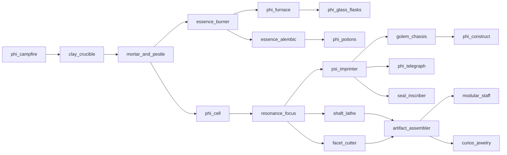

# Technomagic tree

Free-craft progression catalog (no recipe gating). Building and using gear marks nodes as **discovered** in the Primer Technomancy list.

See also [ROADMAP.md](ROADMAP.md) Stage IV — **in progress: catalog + Era I–III**.

## Eras

| Era | Theme | Status |
|-----|--------|--------|
| I — Hearth | Torch, campfire heat, crucible, mortar | **Playable** |
| II — Workshop | Burner, Φ-furnace, glass/flasks, alembic, filters, cell, focus | **Playable** |
| III — Imprint | Ψ-imprinter, golem chassis / Φ-construct, Φ-telegraph, **artifact craft** (lathe/cutter/assembler), **item seals**, **Curios jewelry** | **Playable** |
| IV — Reactors | Spark / Heart / Forge reactors, Φ-bus | Catalog `planned` |
| V — Geo | Geo wells, climate array, portal gate | Catalog `planned` |

## Flow (I–III)

## Era III playable

| Node | ID | Notes |
|------|-----|--------|
| Ψ-Imprinter | `psi_imprinter` | MED+ neighbor heat; Φ-cell drain; focus tier speeds imprint |
| Golem Chassis | `golem_chassis` | Blank craft → imprint → use on ground to spawn tame `phi_construct` |
| Φ-Construct | `phi_construct` | Follow/sit/defend; needs owner Φ-cell charge; 1 per player |
| Φ-Telegraph | `phi_telegraph` | Pair two (same dim); insert cell; pulse with flask/paper |
| Shaft Lathe | `shaft_lathe` | Carve shaft forms (MED heat) |
| Facet Cutter | `facet_cutter` | Cut focus facets (MED heat) |
| Artifact Assembler | `artifact_assembler` | Staff / ring / amulet / charm |
| Seal Inscriber | `seal_inscriber` | Item seals (Seals school + discovery) |
| Modular Staff / Jewelry | `modular_staff`, Curios slots | See [ARTIFACT_CRAFT.md](ARTIFACT_CRAFT.md) |

## Earlier nodes (I–II)

| Node | ID | Notes |
|------|-----|--------|
| Φ-Torch | `phi_torch` | Light + Φ-hint particles |
| Φ-Campfire | `phi_campfire` | `PhiHeatSource` **LOW** |
| Clay Crucible | `clay_crucible` | Ore/crystal → shard (lossy) |
| Mortar / Burner / Alembic / filters / cell / focus | existing | Catalog + machines |

## Data

- Catalog JSON: `data/effecoria/technomagic/*.json`
- Code: `com.effecoria.core.technomagic`
- Heat bus: `PhiHeat` / `PhiHeatSource`
- UI: Primer chapter `TECHNOMAGIC` + Technomancy button → `TechnomagicScreen`
