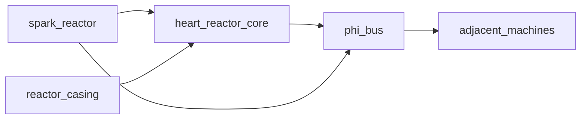

# Technomagic tree

Craft stays **free**. Operating Era N machines requires completing **all available** catalog nodes of eras 1..N−1 (craft their icon items to discover them). Machines also consume prior-era resources (Φ-heat, charged cells, Φ-flux slugs).

See also [ROADMAP.md](ROADMAP.md) Stage IV.

## Progression rules

| Rule | Effect |
|------|--------|
| Free craft | Recipes are never recipe-gated |
| Era complete | Every `available` node in that era is discovered |
| Operate Era N | Eras 1..N−1 must be complete (creative mode bypasses) |
| Resource chain | Era II needs Era I heat; Era III needs MED burner + Φ-cell; Era IV Spark needs flux slug; Heart needs pure essonite / flux priming + coolant |

## Eras

| Era | Theme | Status |
|-----|--------|--------|
| I — Hearth | Torch, campfire heat, crucible, mortar | **Playable** |
| II — Workshop | Burner, Φ-furnace, glass/flasks, alembic, filters, cell, focus | **Playable** |
| III — Imprint | Ψ-imprinter, golem / telegraph, artifact craft, seals, jewelry | **Playable** |
| IV — Reactors | Spark, **Heart 3×3×3**, **Φ-bus**; Forge planned | **Spark + Heart + bus playable** |
| V — Geo | Geo wells, climate array, portal gate | Catalog `planned` |

## Era IV Heart multiblock (3×3×3)

Around `heart_reactor_core`:

| Position | Block |
|----------|--------|
| 8 corners | `void_obsidian` |
| 12 edges | `reactor_casing` |
| 6 face centers | `phi_glass` |
| Center | `heart_reactor_core` |

When the shell is valid, it **assembles**: shell cells become invisible `heart_reactor_part`s and the core BER draws one solid textured 3×3×3. Click any part/core to open the fuel GUI. Breaking a part or the core dismantles and restores the materials (broken cell drops its original block).

Prime with **1× pure essonite** or **4× phi_flux_slug**, then START. Ambient Φ while formed+running (`PhiPower` radius 8). Place ice/water/Φ-water just outside the shell to cool. Adjacent `phi_bus` carries power (BFS, hop attenuation); bus outlets are `PhiPowerProvider` radius 1.

## Flow

## Data

- Catalog: `data/effecoria/technomagic/*.json`
- Code: `HeartMultiblock`, `HeartReactorBlockEntity`, `PhiBusNetwork`, `PhiBusBlockEntity`
- `PhiPower` scan radius 8 (covers Heart)
- Gates: `TechnomagicGates` / `TechnomagicProgress`
