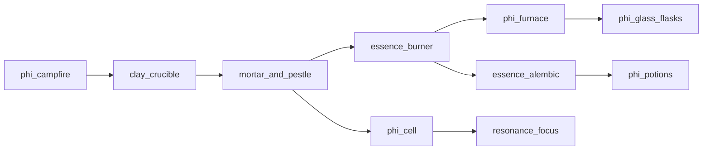

# Technomagic tree

Free-craft progression catalog (no recipe gating). Building and using gear marks nodes as **discovered** in the Primer Technomancy list.

See also [ROADMAP.md](ROADMAP.md) Stage IV — **in progress: catalog + Era I–II**.

## Eras

| Era | Theme | Status |
|-----|--------|--------|
| I — Hearth | Torch, campfire heat, crucible, mortar | **Playable** |
| II — Workshop | Burner, Φ-furnace, glass/flasks, alembic, filters, cell, focus | **Playable** |
| III — Imprint | Ψ-imprinter, golems, telegraph | Catalog `planned` |
| IV — Reactors | Spark / Heart / Forge reactors, Φ-bus | Catalog `planned` |
| V — Geo | Geo wells, climate array, portal gate | Catalog `planned` |

## Flow (I–II)

## Playable nodes

| Node | ID | Notes |
|------|-----|--------|
| Φ-Torch | `phi_torch` | Light + Φ-hint particles (not a heat source) |
| Φ-Campfire | `phi_campfire` | `PhiHeatSource` **LOW**; fuel with essonite dust/shard |
| Clay Crucible | `clay_crucible` | Ore/crystal → `essonite_shard` (~55%) or cobble waste |
| Mortar | `mortar_and_pestle` | Existing |
| Essence Burner | `essence_burner` | Existing MED heat |
| Φ-Furnace | `phi_furnace` | Neighbor heat; shard→`pure_essonite`; dust/sand→`phi_glass` |
| Glass workshop | `glass_workshop` | Catalog tip — furnace + craft (`phi_glass` / flasks) |
| Alembic + filters | `essence_alembic`, `gold_filter`, `lead_filter` | Existing |
| Phi Cell / Focus | `phi_cell`, `resonance_focus` | Existing |

## Data

- Catalog JSON: `data/effecoria/technomagic/*.json`
- Code: `com.effecoria.core.technomagic`
- Heat bus: `PhiHeat` / `PhiHeatSource`
- UI: Primer chapter `TECHNOMAGIC` + Technomancy button → `TechnomagicScreen`
